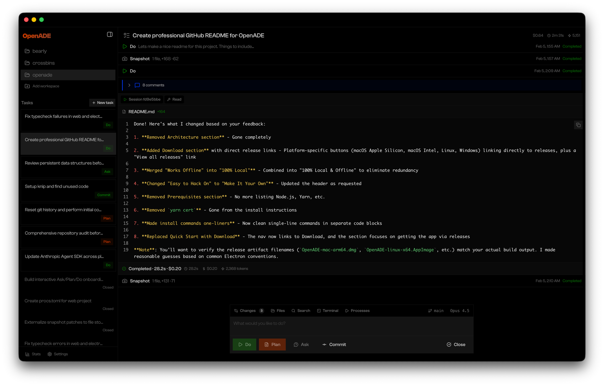

<p align="center">
  
</p>

<h1 align="center">OpenADE</h1>

<p align="center">
  <strong>Agentic Development Environment for Devs Who Don't Ship Slop</strong>
  <br />
  <sub>Free Local Software · Powered by Claude Code</sub>
</p>

<p align="center">
  <a href="https://github.com/bearlyai/OpenADE/releases"></a>
  <a href="https://github.com/bearlyai/OpenADE/blob/main/LICENSE"></a>
  <a href="https://discord.gg/EE8PHSpryH"></a>
  
  
</p>

<p align="center">
  <a href="https://openade.ai">Website</a> •
  <a href="#features">Features</a> •
  <a href="#why-openade">Why OpenADE</a> •
  <a href="#download">Download</a> •
  <a href="#contributing">Contributing</a> •
  <a href="https://discord.gg/EE8PHSpryH">Discord</a>
</p>

---

<p align="center">
  
</p>

---

## Download

<p align="center">
  <a href="https://github.com/bearlyai/OpenADE/releases/download/v0.55.0/OpenADE-0.55.0-universal.dmg"></a>
  <a href="https://github.com/bearlyai/OpenADE/releases/download/v0.55.0/OpenADE-0.55.0-arm64.AppImage"></a>
</p>

<details>
<summary><strong>🪟 Windows (Experimental)</strong></summary>

<br>

Windows support is early and largely untested — you will likely hit rough edges. If you're patient and willing to report bugs, we'd love your help shaking things out:

<p align="center">
  <a href="https://github.com/bearlyai/OpenADE/releases/download/v0.55.0/OpenADE-Setup-0.55.0.exe"></a>
</p>

> **Tip:** For a more reliable experience on Windows, you can run the Linux build inside [WSL (Windows Subsystem for Linux)](https://learn.microsoft.com/en-us/windows/wsl/) instead.

</details>

<p align="center">
  <a href="https://github.com/bearlyai/OpenADE/releases">View all releases →</a>
</p>

---

## Why OpenADE?

Most AI coding tools throw agents at your codebase and hope for the best. You end up babysitting, fixing hallucinations, and wondering if the "AI-assisted" code is actually worse than writing it yourself.

**OpenADE takes a different approach: Plan → Revise → Execute.**

By spending time upfront to craft and refine your implementation plan, you can run agents linearly with confidence. No more context-switching. No more "wait, what did it just do?" moments. Just saturated throughput and maximal work done.

We built this as a side project at [Bearly AI](https://bearly.ai) over a few weeks—within days it was building itself. The ability to drill down on plans makes agent execution feel almost deterministic. It killed todo lists for us—we just fire off initial plans and come back when we're ready. It's now 90% of our screen time, replacing our IDE and terminal.

---

## Features

### 🎯 Plan → Revise → Do Workflow
Describe your task, get a detailed implementation plan, refine it with inline comments, then execute with a single click. Your agents work from a shared understanding—not vibes.

### 💬 Comment on Anything
Files, diffs, changes, agent messages—everything is commentable. Point the agent directly at what you want to fix or improve. Type less, iterate faster, ship better.

### 🖥️ Built for Terminal Lovers
Information-dense, text-heavy, sharp corners, great syntax colors. If you love the terminal aesthetic, you'll feel right at home.

### 🔌 MCP Servers & Connectors
First-class support for 15+ integrations out of the box: **Linear**, **Notion**, **Asana**, **Stripe**, **Vercel**, **GitHub**, and more. Bring your whole workflow into the loop.

### 🔒 100% Local & Offline
Your code never leaves your machine. No cloud. No syncing to someone else's servers. Works without an internet connection.

> **Telemetry**: Optional anonymous telemetry. Easily disabled in settings.

### ⌨️ Thoughtful UX
- **Beautiful drafting input** with rich text and @ mentions
- **Single-key actions** for common workflows
- **@ file references**, skills, and slash commands

### 🗂️ IDE Essentials Built In
Diff viewer, file browser, fast search, full terminal, and process manager—all without leaving the app.

### 💳 Uses Your Existing Claude Subscription
No separate billing. No per-seat licensing. Works with your existing Claude Code subscription.

> **Coming soon**: Codex support

### ⚡ Fast & Lean
Snappy & Clean. We use the app 8+ hours a day so we make sure it is.

### 📸 Automated Git Snapshots
Every execution creates a patch snapshot. **Rollback to any point** with a click. Never lose work.

### 🌳 Worktree Support
Isolate experiments in git worktrees. Keep your main branch clean while agents explore.

### 🔔 Notifications
Fire off a task, go scroll X and TikTok, get pinged when it's done. We don't judge.

### 📊 Usage Stats & Scoreboards
Track your throughput. See what's working. Optimize your flow.

### 🎨 Fully Themeable
Dark, light, synthwave, or roll your own. Make it yours.

### 🛠️ Make It Your Own
Clean architecture. TypeScript throughout. MobX state management. Built to be extended.

---

## The Anti-Feature

**You can't edit code directly in OpenADE.**

We know, we know. Here's the thing: after working this way for a while, we've found that agents are *fast* at making small changes—and they respect your automations, docs, and conventions while doing it. Often they'll catch something you would have missed.

Let them cook. 🧑‍🍳

---

## Download Links

| Platform | Download |
|----------|----------|
| macOS (Universal) | [OpenADE-0.55.0-universal.dmg](https://github.com/bearlyai/OpenADE/releases/download/v0.55.0/OpenADE-0.55.0-universal.dmg) |
| Linux (arm64) | [OpenADE-0.55.0-arm64.AppImage](https://github.com/bearlyai/OpenADE/releases/download/v0.55.0/OpenADE-0.55.0-arm64.AppImage) |
| Windows (Experimental) | [OpenADE-Setup-0.55.0.exe](https://github.com/bearlyai/OpenADE/releases/download/v0.55.0/OpenADE-Setup-0.55.0.exe) |

> **Note:** The Windows build is experimental and largely untested — expect rough edges. For a smoother experience, try running the Linux build via [WSL](https://learn.microsoft.com/en-us/windows/wsl/).

[View all releases →](https://github.com/bearlyai/OpenADE/releases)

---

## Contributing

We'd love your help making OpenADE better.

### Development

```bash
git clone git@github.com:bearlyai/OpenADE.git && cd OpenADE
```

```bash
cd projects/web && yarn && yarn start
```

```bash
cd projects/electron && yarn && yarn start
```

Or, if you're feeling meta: clone it, open it *in* OpenADE, and start the processes from there. 🔄

---

## Community

<a href="https://discord.gg/EE8PHSpryH">
  
</a>

Questions? Ideas? Found a bug? Come hang out.

---

## License

MIT © [Bearly AI](https://bearly.ai)
